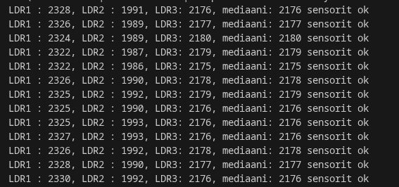

# LDR-sensorit ja vikasietoisuus

Tässä projektissa kokeillaan miten ESP32 saadaan toimimaan luotettavasti vaikka jokin sensori menisi rikki. Käytössä on kolme valovastusta ja vähän tekoälyä.

## Miten se toimii

Ideana on lukea kolmea sensoria yhtä aikaa. Koodi valitsee niistä keskimmäisen arvon eli mediaanin. Näin saadaan tasainen lukema vaikka yksi sensori alkaisi sekoilemaan tai johto irtoaisi. 

Lisäksi mukana on pieni One-Class SVM -malli. Se seuraa miten paljon kukin sensori heittää mediaanista. Jos jokin sensori alkaa poikkeamaan liikaa muista, syttyy punainen valo merkiksi viasta. Malli opetetaan ensin tietokoneella ja siirretään sitten ESP32:lle.

## Mitä ongelmia oli

Matkan varrella tuli muutama juttu vastaan mitkä piti korjata:

LDR-vastukset olivat halvinta mahdollista mallia suoraan Kiinasta, joten ne olivat aika epätarkkoja. CSV-tiedostosta näkee hyvin, että vaikka valaistus olisi kaikille sama, jokainen antaa ihan eri lukemia. Tämän takia koodin piti osata käsitellä näitä eroja eikä olettaa, että kaikki näyttävät samaa.

Sensorien lukemat myös hyppivät muutenkin aika paljon, joten koodiin piti lisätä suodatus tasoittamaan tuloksia. Ilman sitä tuli liikaa turhia hälytyksiä.

Koneoppimiskirjasto teki välillä vähän rikkinäistä koodia. Sinne piti tehdä muutama korjaus käsin, että se suostui kääntymään ESP32:lla oikein.

Sopivan herkkyyden löytäminen oli haastavaa. Jos malli on liian tarkka, se luulee jokaista pientä varjoa viaksi. Jos se taas on liian löysä, se ei huomaa jos jokin sensori oikeasti hajoaa. Tätä joutui säätämään monta kertaa.

## Video

